# Layer 0: Business

Understand the client's business before building anything. This layer captures who the client is, what they do, how they operate, and what forces shape their decisions. It is the foundation that every downstream layer inherits from.

**Owner:** PM / Engagement Lead

**Contributors:** Client stakeholders, anyone involved in discovery

**Scope:** Per client or engagement. Created once during onboarding, updated rarely. A single Business layer can feed multiple projects over the life of a client relationship.

---

## Pipeline

Every layer follows the same refinement pipeline: raw inputs are gathered, synthesized into intermediate artifacts, and refined into final documents. The final documents are the source of truth for this layer.

```mermaid
flowchart LR
    subgraph raw [Raw Inputs]
        R1[Client Materials]
        R2[Discovery Calls]
        R3[Stakeholder Interviews]
        R4[Research]
        R5[Historical Materials]
    end

    subgraph intermediate [Intermediate Artifacts]
        I1[Interview Synthesis]
        I2[Business Model Summary]
        I3[Constraint Register]
        I4[Competitive Research]
        I5[Goal Alignment Matrix]
    end

    subgraph final [Final Documents]
        F1[Business Overview]
        F2[Strategic Goals\nand Constraints]
        F3[Stakeholder Map]
        F4[Competitive Landscape]
    end

    raw --> intermediate
    intermediate --> final
    final -->|"feeds into"| Layer1[Layer 1: Product]
```

### Raw Inputs

Materials gathered, not authored. See [raw-inputs/README.md](raw-inputs/README.md) for the full collection checklist.

### Intermediate Artifacts

Synthesis products that bridge raw inputs to final documents. These are working documents — iterative, living, and potentially messy. How you get from raw inputs to final documents will vary by engagement; the `intermediate/` folder contains example templates for common synthesis activities, not a required checklist.

Examples include interview synthesis, business model summaries, constraint registers, competitive research compilations, and goal alignment matrices. See [intermediate/](intermediate/) for available templates.

### Final Documents

Canonical, reviewed, consumable. These are the source of truth for this layer. Each carries full YAML frontmatter for cascade tracking.

| Document | What It Covers |
|---|---|
| [Business Overview](final/business-overview.md) | Company identity, business model, customer segments, organizational structure, existing systems |
| [Strategic Goals and Constraints](final/strategic-goals-and-constraints.md) | Business objectives, engagement drivers, constraints by type |
| [Stakeholder Map](final/stakeholder-map.md) | People, roles, decision-making authority, influence, dynamics |
| [Competitive Landscape](final/competitive-landscape.md) | Market position, competitors, differentiators, industry trends |

---

## Tools

The `tools/` folder contains AI skills and process guides that accelerate producing the artifacts above. See [tools/](tools/) for the full list.

---

## Inheritance

All four final documents from this layer are available as raw inputs to **Layer 1 (Product)** and can be referenced by any downstream layer that needs business context. Layer 1 documents list the relevant Layer 0 files in their `relates_to` frontmatter, which enables the cascade mechanism to track when related documents change and need review.

---

## When to Create

Create this layer during **client onboarding** or **engagement kickoff** — before any product definition work begins. The goal is not completeness on day one but having a structured place to capture business understanding as it develops.

## When to Update

Update when something fundamental changes about the client's business: new market, acquisition, leadership change, strategic pivot, or regulatory shift. This layer should not change on every project or sprint — if it does, the information likely belongs in Layer 1 (Product) instead.
