# Layer 1: Product

Define the problem space, the users, and what we're building. This layer is where alignment happens and ambiguity gets resolved. It captures product behavior at a level that any stakeholder — PM, designer, client, engineer — can read and validate, and produces structured artifacts that feed directly into downstream technical documentation.

**Owner:** PM

**Contributors:** Designer, Tech Lead, stakeholders, client

**Scope:** Per project or product. Created during product definition, updated as the product evolves. A single Layer 0 (Business) can feed multiple Layer 1 products over the life of a client relationship.

---

## Pipeline

Every layer follows the same refinement pipeline: raw inputs are gathered, synthesized into intermediate artifacts, and refined into final documents. The final documents are the source of truth for this layer.

```mermaid
flowchart LR
    subgraph upstream [Layer 0 Finals]
        U1[Business Overview]
        U2[Strategic Goals\nand Constraints]
        U3[Stakeholder Map]
        U4[Competitive Landscape]
    end

    subgraph raw [Raw Inputs]
        R1[Client Briefs]
        R2[Meeting Transcripts]
        R3[Stakeholder Interviews]
        R4[Market Research]
        R5[Existing Product Docs]
    end

    subgraph intermediate [Intermediate Artifacts]
        I1[Ideation]
        I2[Problem Statements]
        I3[Solution Explorations]
        I4[Gap Analysis]
    end

    subgraph final [Final Documents]
        F1[Product Brief]
        F2[User Personas]
        F3[Feature Specs]
        F4[User Journeys]
        F5[Success Metrics]
        F6[Domain Glossary]
    end

    upstream --> intermediate
    raw --> intermediate
    intermediate --> final
    final -->|"feeds into"| Layer2[Layer 2: Design]
    final -->|"feeds into"| Layer3[Layer 3: Architecture]
```

### Raw Inputs

Materials gathered, not authored. Includes all Layer 0 final documents as primary upstream inputs. See [raw-inputs/README.md](raw-inputs/README.md) for the full collection checklist.

### Intermediate Artifacts

Synthesis products that bridge raw inputs to final documents. These are working documents — iterative, living, and potentially messy. How you get from raw inputs to final documents will vary by project; the `intermediate/` folder contains example templates for common synthesis activities, not a required checklist.

Examples include ideation outputs, problem statements, solution explorations, and gap analyses. See [intermediate/](intermediate/) for available templates.

### Final Documents

Canonical, reviewed, consumable. These are the source of truth for this layer. Each carries full YAML frontmatter for cascade tracking.

| Document | What It Covers | Structure |
|---|---|---|
| [Product Brief](final/product-brief.md) | Problem space, target users, product vision, scope, assumptions, relationship to business goals | Single file |
| [User Personas](final/user-personas.md) | Who the product serves — distinct user types, goals, pain points, behaviors | Single file |
| [Domain Glossary](final/domain-glossary.md) | Shared vocabulary — domain-specific terms, acronyms, and definitions used across all layers | Single file |
| [Success Metrics](final/success-metrics.md) | Product-level KPIs, measurement approach, baselines and targets | Single file |
| [User Journeys](final/user-journeys/) | Cross-feature views of how users accomplish goals through the product | One file per journey |
| [Feature Specs](final/features/) | Product behavior defined per feature — business rules, acceptance criteria, edge cases, scope | One file per feature, organized by domain |

---

## Tools

The `tools/` folder contains AI skills and process guides that accelerate producing the artifacts above. See [tools/](tools/) for the full list.

---

## Inheritance

**Upstream:** All four final documents from Layer 0 (Business) are explicit inputs to this layer. They provide the business context — client goals, constraints, stakeholder dynamics, competitive landscape — that shapes every product decision. Layer 1 documents list the relevant Layer 0 files in their `relates_to` frontmatter.

**Downstream:** This layer's final documents are the primary inputs to Layer 2 (Design) and Layer 3 (Architecture). Feature specs feed directly into design work and technical architecture. The product brief, user personas, domain glossary, and success metrics provide shared context across both downstream layers. The cascade mechanism tracks when Layer 1 documents change and flags downstream documents for review.

---

## When to Create

Create this layer during **product definition** — after Layer 0 (Business) is established and before design or architecture work begins. Start with the Product Brief to align on scope, then build out feature specs as the product takes shape.

## When to Update

Update when product scope, features, or business rules change. This layer changes more frequently than Layer 0 but should not change on every sprint — if feature specs are changing weekly, the product is likely still in discovery and the specs should carry `status: in_progress` until they stabilize. Feature specs for new features are added as the product grows.
