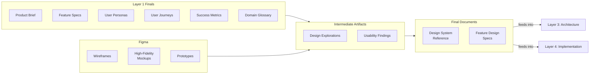

# Layer 2: Design

Define the user experience — what people interact with, how it behaves, how it feels. This layer bridges product definition and technical implementation, translating feature specs and user journeys into visual and interaction specifications that engineers can build from.

**Owner:** Designer

**Contributors:** PM (scope validation), QA (accessibility), Tech Lead (feasibility)

**Scope:** Per project or product. Created after Layer 1 (Product) is established, updated as designs evolve. When this layer does not apply — API-only projects, data pipelines, backend systems, or projects without a dedicated designer — mark it as N/A. Layer 3 takes its inputs directly from Layers 0 and 1 in those cases.

---

## Pipeline

Every layer follows the same refinement pipeline: raw inputs are gathered, synthesized into intermediate artifacts, and refined into final documents. The final documents are the source of truth for this layer.

### Raw Inputs

Materials gathered, not authored. Includes all Layer 1 final documents as primary upstream inputs, plus Figma files and client-provided design assets. See [raw-inputs/README.md](raw-inputs/README.md) for the full collection checklist.

### Intermediate Artifacts

Synthesis products that bridge raw inputs to final documents. These are working documents — iterative, living, and potentially messy. How you get from raw inputs to final documents will vary by project; the `intermediate/` folder contains example templates for common synthesis activities, not a required checklist.

Examples include design explorations (capturing direction decisions and trade-offs before the final design exists) and usability findings (synthesizing test results into actionable changes). See [intermediate/](intermediate/) for available templates.

### Final Documents

Canonical, reviewed, consumable. These are the source of truth for this layer. Each carries full YAML frontmatter for cascade tracking.

| Document | Scope | What It Covers |
|---|---|---|
| [Design System Reference](final/design-system-reference.md) | One per project | Figma library, design variables, naming conventions, component usage rules, pattern decisions, accessibility standards |
| [Feature Design Specs](final/features/) | One per feature (mirrors Layer 1 structure) | Design assets (Figma links), states and behavior, interactions and motion, responsive behavior, content specifications, accessibility |

---

## Tools

The `tools/` folder contains AI skills and process guides that accelerate producing the artifacts above. See [tools/](tools/) for the full list.

---

## Inheritance

**Upstream:** All final documents from Layer 1 (Product) are explicit inputs to this layer. They provide the product context — feature behavior, user personas, journeys, and success criteria — that shapes every design decision. Layer 2 documents list the relevant Layer 1 files in their `relates_to` frontmatter. Layer 2 does not depend directly on Layer 0 — any business context relevant to design is already synthesized into Layer 1's documents.

**Downstream:** This layer's final documents are inputs to Layer 3 (Architecture) and Layer 4 (Implementation). Feature design specs and the design system reference together give engineers the complete picture of what to build — Layer 1 defines what it does and why, Layer 2 defines how it looks and behaves. The cascade mechanism tracks when Layer 2 documents change and flags downstream documents for review.

---

## What This Layer Does Not Cover

Layer 2 documents only what cannot be inferred from the Layer 1 feature spec or the Figma file itself. It does not:

- Re-describe feature behavior or business rules (those are in the Layer 1 feature specs)
- Contain a visual component catalog (that lives in Figma and/or Storybook)
- Define technical implementation (that is Layer 3 and Layer 4)

The feature design spec is a **thin complement** to the feature spec and Figma — not a standalone document that could be read in isolation.

---

## When to Create

Create this layer after **Layer 1 (Product) feature specs are established** and design work begins. Start with the Design System Reference to capture project-wide design variables and patterns, then add feature design specs as each feature moves through design.

## When to Update

Update when design decisions change in ways that affect implementation — new states, changed interaction patterns, updated responsive behavior, revised accessibility requirements. Visual-only changes that are self-evident in the updated Figma file do not require a doc update. If a Layer 1 feature spec changes (new business rules, revised acceptance criteria), review and update the corresponding feature design spec.
