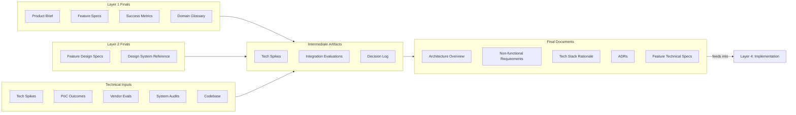

# Layer 3: Architecture

Define the structural decisions — system boundaries, components, integrations, and the reasoning behind each choice. This layer translates product and design intent into a technical blueprint that engineers can build from and that survives the life of the project.

**Owner:** Tech Lead

**Contributors:** DevOps, senior engineers, PM (constraints), QA (test strategy, quality attributes)

**Scope:** Per project or product. Created after Layer 1 (Product) is established, updated as significant technical decisions are made. When Layer 2 (Design) applies, its final documents are included as inputs before this layer is completed.

---

## Pipeline

Every layer follows the same refinement pipeline: raw inputs are gathered, synthesized into intermediate artifacts, and refined into final documents. The final documents are the source of truth for this layer.

### Raw Inputs

Materials gathered, not authored. Includes all Layer 1 final documents as primary upstream inputs, Layer 2 final documents when applicable, and technical discovery materials. See [raw-inputs/README.md](raw-inputs/README.md) for the full collection checklist.

### Intermediate Artifacts

Synthesis products that bridge raw inputs to final documents. These are working documents — iterative, living, and potentially messy. The `intermediate/` folder contains example templates for common synthesis activities, not a required checklist.

Examples include tech spike results, integration evaluations, and a running decision log that feeds into ADRs. See [intermediate/](intermediate/) for available templates.

### Final Documents

Canonical, reviewed, consumable. These are the source of truth for this layer. Each carries full YAML frontmatter for cascade tracking.

| Document | Scope | What It Covers |
|---|---|---|
| [Architecture Overview](final/architecture-overview.md) | One per project | System context, container view, key integrations, data architecture, security, infrastructure |
| [Non-functional Requirements](final/nonfunctional-requirements.md) | One per project | Performance, scalability, availability, security, observability, compliance |
| [Tech Stack Rationale](final/tech-stack-rationale.md) | One per project | Core stack, infrastructure, third-party services, development tooling — with rationale for each choice |
| [ADRs](final/adrs/) | One per significant decision | Context, decision, consequences, alternatives considered |
| [Feature Technical Specs](final/features/) | One per feature (mirrors Layer 1 structure) | Full-stack technical specification: data model, API contracts, frontend architecture, key flows, work breakdown |

---

## Tools

The `tools/` folder contains AI skills and process guides that accelerate producing the artifacts above. See [tools/](tools/) for the full list.

---

## Inheritance

**Upstream:** All final documents from Layer 1 (Product) are explicit inputs to this layer. Layer 2 (Design) final documents are inputs when the project has a UI component — feature design specs and the design system reference inform both the frontend architecture sections of feature technical specs and the overall architecture decisions. Layer 3 documents list relevant upstream files in their `relates_to` frontmatter.

**Downstream:** This layer's final documents are the primary inputs to Layer 4 (Implementation). The Architecture Overview, ADRs, and Feature Technical Specs together give engineers the complete picture of what to build and why. The cascade mechanism tracks when Layer 3 documents change and flags downstream documents for review.

---

## When to Create

Create this layer after **Layer 1 (Product) feature specs are established** and the product scope is sufficiently defined. Start with the Architecture Overview to establish system boundaries, then the Non-functional Requirements, then the Tech Stack Rationale. Feature Technical Specs are added as individual features move into architecture — they do not all need to exist before implementation begins.

## When to Update

Update when structural decisions change: new components, revised integration strategy, changed data architecture, new ADRs. Feature Technical Specs are updated when the corresponding Layer 1 or Layer 2 documents change (the cascade mechanism flags them) or when implementation reveals gaps. The Architecture Overview and NFRs change less frequently than feature specs — if they are changing often, the architecture is still in discovery.
