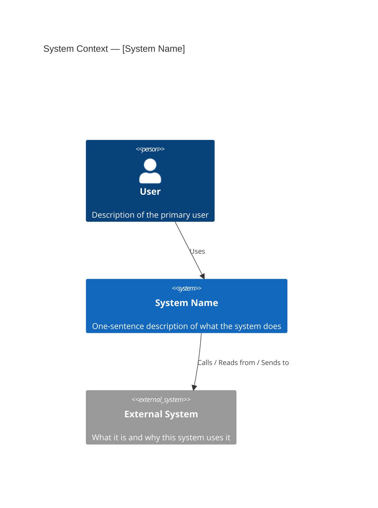
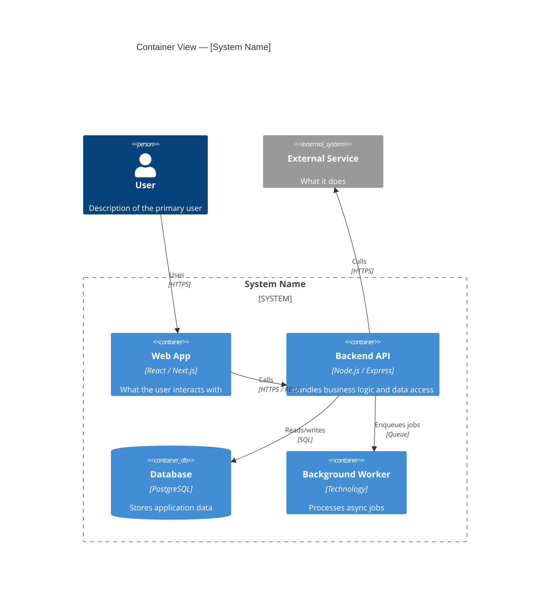

# Architecture Overview

The system-level map of this product. This document defines what the system is, how its major components relate, how it integrates with external services, and the structural decisions that shape everything downstream. It is the first document engineers and tech leads read to understand the system — and the document that all Feature Technical Specs are written against.

This is not a feature-by-feature specification. Feature-level technical details live in the [Feature Technical Specs](features/). This document covers the structure that all features share.

---

## System Context

A C4 Level 1 view: what this system is, who uses it, and what external systems it connects to. Read this as the outermost boundary — everything inside the box is what we build; everything outside is what we integrate with or depend on.

> **What is C4?** C4 is a model for describing software architecture at four levels of abstraction (Context, Container, Component, Code). This document uses Levels 1 and 2 only — the levels that stay useful and maintainable over the life of a project. Levels 3 and 4 are too granular for documentation; that detail lives in the code and in the Feature Technical Specs.

> **Guiding questions:**
>
> - What is the name of the system? How would you describe it in one sentence?
> - Who are the human users? Reference personas from Layer 1 if they exist.
> - What external systems does this system interact with — other software, APIs, services, or data sources?
> - For each external system: does data flow in, out, or both? What triggers the interaction?

*Replace the placeholders above. Add a `Person` for each distinct user type and a `System_Ext` for each external dependency. Keep labels short — detail goes in the table below.*

| External System | Type | Data Flow | Purpose |
| --------------- | ---- | --------- | ------- |
| | API / Database / Service / Event source | Inbound / Outbound / Both | |

---

## Container View

A C4 Level 2 view: the major deployable or independently runnable components inside the system boundary and how they communicate. This is the view engineers use to understand where code lives and how pieces connect.

> **Note on the term "container":** In C4, a container is any runnable unit with a technology choice — web app, backend API, database, background worker, message queue. It is not specific to Docker containers, though they often map to them.

> **Guiding questions:**
>
> - What are the major components — web frontend, backend API, background workers, databases, caches, queues, third-party services consumed internally?
> - For each component: what is it responsible for? What technology does it use?
> - How do components communicate — HTTP, gRPC, message queue, event bus, shared database?
> - Are there components that can be scaled independently?
> - Are there components with different deployment lifecycles?

*Replace the placeholders above. Add a `Container` for each major component, using the technology field to note the specific stack. Keep responsibilities short — detail goes in the table below.*

| Component | Technology | Responsibility | Communicates With |
| --------- | ---------- | -------------- | ----------------- |
| | | | |

---

## Data Architecture

The high-level strategy for how data is stored, structured, and flows through the system. This is not a schema — per-feature schemas live in the Feature Technical Specs. This section captures the storage strategy and cross-cutting data decisions.

> **Guiding questions:**
>
> - What databases or storage systems does this product use? What is each responsible for?
> - Is there a primary database? Is data distributed across multiple stores?
> - What is the approach to data ownership — does each service own its data, or is there a shared database?
> - How is data shared between components — direct database access, APIs, event streams?
> - Are there caching layers? What is the caching strategy?
> - How is data backed up? What are the retention requirements?
> - Are there any data residency or sovereignty requirements?
>
> **Recommended length:** 1-2 paragraphs with a supporting table for storage systems.

| Storage System | Type | What It Stores | Access Pattern |
| -------------- | ---- | -------------- | -------------- |
| | SQL / NoSQL / Cache / Object storage / Search | | Read-heavy / Write-heavy / Mixed |

---

## Security Architecture

The structural security decisions — how authentication and authorization work, where trust boundaries are, and how sensitive data is protected. Feature-specific security details belong in the Feature Technical Specs.

> **Guiding questions:**
>
> - How are users authenticated? (JWT, session-based, OAuth, SSO, API keys)
> - How is authorization enforced? (RBAC, ABAC, per-resource policies) Where is it enforced — middleware, service layer, database?
> - What are the trust boundaries? Which components can talk to which, and what validates that trust?
> - How is sensitive data identified and protected — at rest and in transit?
> - How are secrets and credentials managed? (environment variables, secrets manager, vault)
> - Are there compliance requirements (GDPR, HIPAA, SOC 2, PCI-DSS) that shape the security model?
>
> **Recommended length:** 1-2 paragraphs per topic. Use a table for compliance requirements if they exist.

---

## Infrastructure Overview

How the system is deployed and operated. This is not a runbook — operational details live in Layer 5. This section captures the structural infrastructure decisions that architecture owns.

> **Guiding questions:**
>
> - What cloud provider(s) are used? What regions?
> - What are the environments — development, staging, production? Are there preview or sandbox environments?
> - How is the system deployed — containers, serverless, VMs, PaaS?
> - What is the CI/CD pipeline structure? How does code get from repository to production?
> - How is infrastructure defined — infrastructure as code (Terraform, Pulumi, CDK), cloud console, or managed by the client?
> - Are there any multi-region or high-availability infrastructure requirements?
>
> **Recommended length:** 1-2 paragraphs. A table for environments is helpful.

| Environment | Purpose | Infrastructure | Access |
| ----------- | ------- | -------------- | ------ |
| Development | | | Team only |
| Staging | | | Team + Client |
| Production | | | Restricted |

---

## Open Questions

Unresolved architectural items. This section should be empty when the document reaches `status: established`.

| Question | Context | Owner | Target Date | Status | Resolution |
| -------- | ------- | ----- | ----------- | ------ | ---------- |
| | | | | Open / Resolved | |
