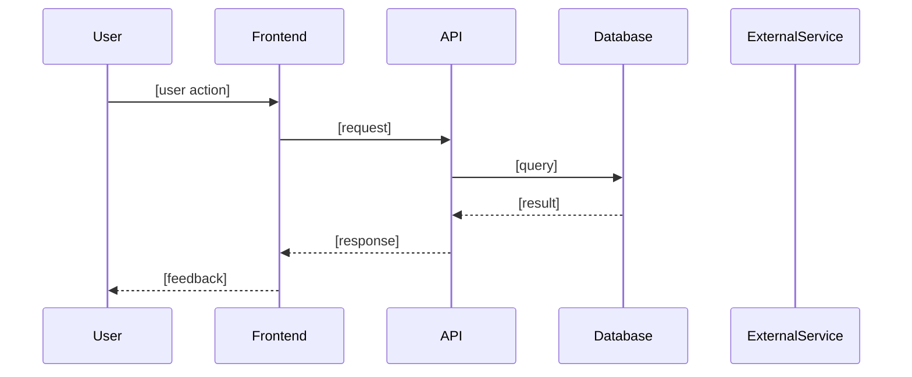
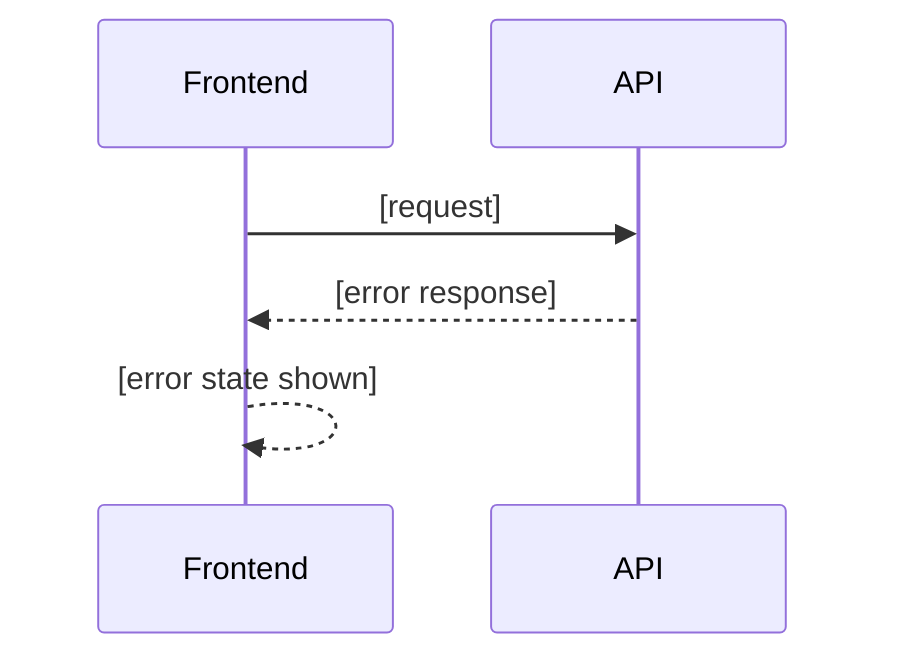

# Feature Technical Spec: [Feature Name]

A full-stack technical specification for a single feature. Read the [Layer 1 Feature Spec](../../../../layer-1-product/final/features/_example-domain/_example-feature-spec.md) first — it defines what this feature does, who it's for, the business rules, and the acceptance criteria. Read the [Layer 2 Feature Design Spec](../../../../layer-2-design/final/features/_example-domain/_example-feature-design-spec.md) when applicable — it defines the visual and interaction behavior.

This document covers how the feature will be built: the technical approach, data model changes, API contracts, frontend architecture, integration dependencies, key flows, and the complete work breakdown across all implementation surfaces. It is designed to be self-contained — an AI model or engineer should be able to implement from this spec without needing to cross-reference upstream documents for day-to-day implementation decisions.

---

## Overview

*What technical problem does this feature introduce? One paragraph that frames the engineering challenge — not a restatement of the feature, but the specific technical problem we are solving and how it fits into the existing architecture.*

> **Guiding questions:**
>
> - What is the core technical challenge this feature introduces?
> - How does this feature fit within the boundaries described in the Architecture Overview?
> - Are there existing patterns in the codebase this feature follows, or does it introduce something new?
> - What makes this feature technically non-trivial?

---

## Acceptance Criteria

What "done" looks like — carried forward from the [Layer 1 Feature Spec](../../../../layer-1-product/final/features/_example-domain/_example-feature-spec.md) and translated into technically verifiable assertions. Product-level criteria (what the user can do) are listed alongside technical criteria (what the system must enforce) so that implementation and testing have a single, complete definition of done.

> **Guiding questions:**
>
> - What are the product-level acceptance criteria from the Layer 1 Feature Spec? Carry them forward here — do not leave them behind a link.
> - What technical assertions must also be true — response times, data integrity, security validations, error handling behavior?
> - Are there non-functional criteria from the NFRs that apply specifically to this feature?
> - For each criterion: could an automated test verify it? If not, how is it verified?

**Product criteria** *(from Layer 1 Feature Spec):*

- *Criterion 1*
- *Criterion 2*
- *Criterion 3*

**Technical criteria:**

- *Criterion 1 (e.g., API responds within p95 latency target under expected load)*
- *Criterion 2 (e.g., failed payment attempts are logged with correlation ID for traceability)*
- *Criterion 3 (e.g., unauthorized access returns 403 without leaking resource existence)*

---

## Technical Approach

How this feature will be built. High-level enough to orient, specific enough to constrain. This section is written in Phase 1 (from documentation context) and refined in Phase 2 (from codebase context).

> **Guiding questions:**
>
> - What is the overall implementation strategy — which components are affected, what is the data flow?
> - What patterns from the existing architecture does this feature follow?
> - Where does this feature depart from established patterns, and why?
> - What are the key technical decisions made in this spec? (Non-trivial ones become ADRs)
> - How does the backend and frontend interact for this feature?
>
> **Recommended length:** 2-3 paragraphs.

### Business Rules and Constraints

Rules carried forward from the [Layer 1 Feature Spec](../../../../layer-1-product/final/features/_example-domain/_example-feature-spec.md) that directly constrain implementation. These are the rules the code must enforce — include them here so the implementing engineer or AI model does not need to cross-reference the product spec during implementation.

> **Guiding questions:**
>
> - Which business rules from the Layer 1 Feature Spec affect how code is written — validation logic, authorization rules, data constraints, workflow restrictions?
> - Are any rules provisional (may change)? If so, note where the implementation should be flexible.
> - Are there constraints from Layer 0 (regulatory, contractual) that this feature must enforce?


| Rule | Description | Confidence | Implementation Notes |
| ---- | ----------- | ---------- | -------------------- |
| | | Confirmed / Provisional | How this rule affects the code |


---

## Data Model

Schema changes introduced by this feature. Describes what exists today and what changes — not just the end state.

> **Guiding questions:**
>
> - What new entities or tables does this feature require?
> - What existing entities or tables are modified? What fields are added, changed, or removed?
> - What are the relationships between entities — foreign keys, join tables, embedded documents?
> - Are there indexes required for the access patterns this feature introduces?
> - Are migrations required? Is the migration reversible?
> - Are there data seeding or backfill requirements?
>
> **Recommended format:** A Mermaid ER diagram for new or significantly changed entities, followed by a change table.


| Change | Type | Description | Migration Required |
| ------ | ---- | ----------- | ------------------ |
| | New table / Modified table / New field / Removed field / New index | | Yes / No |


> **Skip this section** if this feature introduces no changes to data persistence.

---

## API Contracts

The interface between backend and frontend for this feature. Enough detail for both sides to work in parallel without needing to coordinate on every field.

> **Guiding questions:**
>
> - What new endpoints does this feature introduce?
> - What existing endpoints are modified? What changes?
> - What are the request and response shapes — key fields, types, required vs. optional?
> - What authentication and authorization applies to each endpoint?
> - What error responses are possible — what status codes and error shapes?
> - Are there rate limits or pagination requirements?
>
> **Format:** One subsection per endpoint or interface contract.

### `[METHOD] /path/to/endpoint`

**Purpose:** *What this endpoint does.*

**Authentication:** *Required / Not required. Auth method if required.*

**Request:**

```json
{
  "field": "type — description"
}
```

**Response (200):**

```json
{
  "field": "type — description"
}
```

**Error responses:**

| Status | Condition | Response Shape |
| ------ | --------- | -------------- |
| 400 | | |
| 401 | | |
| 404 | | |

> **Skip this section** if this feature introduces no new or modified API endpoints.

---

## Frontend Architecture

The frontend implementation plan for this feature. Includes design asset links for direct access by engineers and AI tools, alongside the component and state management decisions.

> **Skip this section** for backend-only features (background jobs, data pipelines, API-only endpoints with no frontend surface).

### Design Assets

Figma links carried forward from the [Layer 2 Feature Design Spec](../../../../layer-2-design/final/features/_example-domain/_example-feature-design-spec.md). These provide direct access to the visual designs when implementing frontend tasks — including for AI tools with Figma MCP access.

| Screen / Flow | Figma Link | Status |
| ------------- | ---------- | ------ |
| | | Draft / Ready for Dev / Final |

### Component Architecture

> **Guiding questions:**
>
> - What new components does this feature introduce? Where do they live in the component tree?
> - What existing components are modified? What changes?
> - Are there shared or reusable components that should be extracted?
> - How does this feature's component structure align with the design system established in Layer 2?
> - Are there component boundaries that affect how work is split between engineers?


| Component | Type | Location | Status |
| --------- | ---- | -------- | ------ |
| | New / Modified / Reused | File path (Phase 2) | New / Existing |


### State Management

> **Guiding questions:**
>
> - What state does this feature introduce — local component state, global store, or server state?
> - For server state: what data is fetched, when, and how is it cached and invalidated?
> - For global state: what store or context is used? What actions or mutations are added?
> - Are there optimistic updates or local mutations before server confirmation?
> - How are loading, error, and empty states managed?

*Describe the state management approach in prose. Reference the patterns established in the Architecture Overview or Tech Stack Rationale.*

### Rendering and Routing

> **Guiding questions:**
>
> - Does this feature introduce new routes? What are they?
> - What rendering strategy applies — SSR, CSR, ISR, or static generation? Does it differ from the project default?
> - Are there URL parameters, query strings, or routing guards?
> - Are there any redirects or navigation side effects?
>
> **Skip this section** if this feature introduces no new routes and follows the project's default rendering strategy.

---

## Integration Points

External or internal services this feature depends on. Documents the data flow, failure behavior, and retry strategy — not just the existence of the dependency.

> **Guiding questions:**
>
> - What external services does this feature call — payment processors, email providers, third-party APIs?
> - What internal services or microservices does this feature interact with?
> - For each integration: what data flows in, what flows out, what triggers the call?
> - What happens when an integration is unavailable — does the feature fail hard, degrade gracefully, or queue for retry?
> - Are there idempotency requirements (especially for payment or mutation operations)?
> - Are there SLA or latency requirements on the integration that affect the feature's NFRs?


| Integration | Type | Data Flow | Failure Behavior | Retry Strategy |
| ----------- | ---- | --------- | ---------------- | -------------- |
| | External API / Internal service / Queue / Webhook | Inbound / Outbound / Both | Fail hard / Degrade gracefully / Queue | None / Exponential backoff / Dead letter queue |


> **Skip this section** if this feature has no external or internal service dependencies.

---

## Key Flows

Sequence diagrams for non-trivial paths through this feature. Show the full flow — frontend, backend, and external services — so engineers on any part of the stack can see how their piece fits into the whole.

> **Guiding questions:**
>
> - What is the happy path for this feature? Show the complete sequence from user action to response.
> - What are the critical error paths — what happens when an integration fails, a validation fails, or a business rule is violated?
> - Are there asynchronous flows — background jobs, webhooks, event-driven steps — that need to be shown separately?
> - Are there parallel operations that can or must happen concurrently?
>
> Show the happy path as the primary diagram. Add error/edge path diagrams only for flows that are non-obvious or that engineers have asked about.

### Happy Path



### [Error / Edge Path Name] *(add as needed)*



---

## Technical Constraints and Risks

Known constraints and risks that engineering must account for. Being explicit about risks here prevents surprises during implementation.

> **Guiding questions:**
>
> - Are there performance implications — queries that could be slow, payloads that could be large, operations that block the main thread?
> - Are there security considerations specific to this feature — sensitive data handled, privilege escalation risks, injection surface?
> - Are there scalability concerns — operations that do not scale linearly with data volume or user count?
> - Is there existing technical debt in the affected areas that complicates this feature?
> - Are there external dependencies with reliability or SLA risks?
> - What could go wrong during implementation that isn't obvious from the spec?


| Constraint / Risk | Type | Impact | Mitigation |
| ----------------- | ---- | ------ | ---------- |
| | Performance / Security / Scalability / Tech debt / External dependency | High / Medium / Low | |


---

## Testing Approach

What tests validate this feature. Defines the testing scope so that implementation includes the right coverage from the start — not as an afterthought.

> **Guiding questions:**
>
> - What business logic needs unit tests — validation rules, calculations, authorization checks, data transformations?
> - What flows need integration tests — API endpoint behavior, database interactions, service-to-service calls?
> - What user-facing paths need end-to-end tests — critical happy paths, key error scenarios?
> - Are there non-functional tests needed — load testing for performance-sensitive operations, security testing for auth flows?
> - What edge cases from the Layer 1 Feature Spec should have explicit test cases?

### Unit Tests

*What logic to cover at the unit level. Reference the business rules and acceptance criteria that each test validates.*

- *Test area 1 — what it validates*
- *Test area 2 — what it validates*

### Integration Tests

*What flows to verify across component boundaries — API endpoints, database operations, external service interactions.*

- *Test area 1 — what it validates*
- *Test area 2 — what it validates*

### End-to-End Tests

*What user paths to automate. These should map to the acceptance criteria and key flows defined above.*

- *Test path 1 — what it validates*
- *Test path 2 — what it validates*

---

## Work Breakdown

How this feature decomposes into implementable tasks, covering all layers: backend, frontend, integration, and infrastructure. Each task should be independently deliverable and testable.

This section is written in two phases:
- **Phase 1 (Draft):** Major implementation units are identified based on the technical approach. The Reference column is empty.
- **Phase 2 (Enrich + Ticket):** Tasks are refined based on codebase knowledge, then the Ticket Creation Skill creates tickets and populates the Reference column.

When an upstream change impacts this spec, scan this table for affected tasks and update tickets accordingly.

> **Guiding questions:**
>
> - What are the natural implementation units — tasks that a single engineer can pick up and complete?
> - What must be done first (unblocks others)? What can be done in parallel?
> - Are backend and frontend tasks separated so they can be worked in parallel once the API contract is agreed?
> - Are there infrastructure or configuration tasks (environment variables, feature flags, database migrations) that must precede implementation tasks?
> - Are there testing tasks that belong in the breakdown?


| Task | Layer | Description | Depends On | Reference |
| ---- | ----- | ----------- | ---------- | --------- |
| | Backend / Frontend / Infrastructure / QA | | | — |
