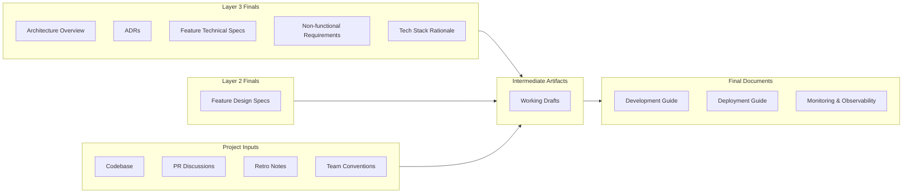

# Layer 4: Implementation & Operations

Enable engineers to contribute effectively without tribal knowledge, and keep the system running once it is in production. This layer bridges the gap between architectural decisions and working code, and captures the operational knowledge needed to deploy, monitor, and maintain the system.

**Owner:** Dev Team (engineers + Tech Lead)

**Contributors:** DevOps, QA (testing approach)

**Scope:** Per project. Created once the architecture layer is sufficiently established and implementation begins. The Development Guide is the only mandatory document — Deployment and Monitoring documents are added as the project matures and the need exists.

---

## Pipeline

Every layer follows the same refinement pipeline: raw inputs are gathered, synthesized into intermediate artifacts, and refined into final documents. The final documents are the source of truth for this layer.

### Raw Inputs

Materials gathered, not authored. Includes all Layer 3 final documents as primary upstream inputs, Layer 2 design specs when applicable, and project-level materials — the codebase, PR discussions, code review threads, and retro notes. See [raw-inputs/README.md](raw-inputs/README.md) for the full checklist.

### Intermediate Artifacts

This layer's synthesis is lighter than earlier layers — the team discusses conventions, patterns, and workflow, reaches agreement, and documents it. Working drafts can live in `intermediate/` if the team finds that useful, but no specific artifact templates are required. See [intermediate/README.md](intermediate/README.md).

### Final Documents

Canonical, reviewed, consumable. These are the source of truth for this layer. Each carries full YAML frontmatter for cascade tracking.

| Document | Required | What It Covers |
|---|---|---|
| [Development Guide](final/development-guide.md) | Mandatory | Coding conventions, testing strategy, branch/PR workflow, key implementation patterns, project-specific tooling |
| [Deployment Guide](final/deployment-guide.md) | Optional | Environments, deployment process, CI/CD pipeline, rollback procedure |
| [Monitoring & Observability](final/monitoring-and-observability.md) | Optional | What is monitored, dashboards, alerting, logging |

---

## Tools

The `tools/` folder contains AI skills and process guides that accelerate producing the artifacts above. See [tools/README.md](tools/README.md) for the full list.

---

## Inheritance

**Upstream:** All final documents from Layer 3 (Architecture) are explicit inputs to this layer — the Architecture Overview, ADRs, Feature Technical Specs, Non-functional Requirements, and Tech Stack Rationale together provide the technical context that implementation and operations docs are written against. Layer 2 (Design) final documents are referenced when the project has a UI component.

**Downstream:** This is the terminal layer. There is no Layer 5. The Development Guide, Deployment Guide, and Monitoring & Observability document are the final artifacts of this framework — they represent the full body of knowledge needed to build, ship, and run the system.

---

## When to Create

Create the Development Guide once the team has begun implementation and the core conventions and patterns are clear enough to document. Do not wait until everything is decided — start with what is settled and fill in the rest iteratively.

Add the Deployment Guide when the deployment process is defined and repeatable, or before a handoff where another team needs to operate the system.

Add the Monitoring & Observability document once monitoring tooling is in place and the team has defined what "healthy" looks like for the system.

## When to Update

The Development Guide updates when conventions change, new patterns are adopted, or the team's workflow evolves. It should reflect how the team actually works — if the guide and reality diverge, update the guide.

The Deployment Guide updates when the deployment process changes — new environments, updated CI/CD configuration, changed rollback procedures.

The Monitoring & Observability document updates when dashboards, alert thresholds, or logging configuration change.
